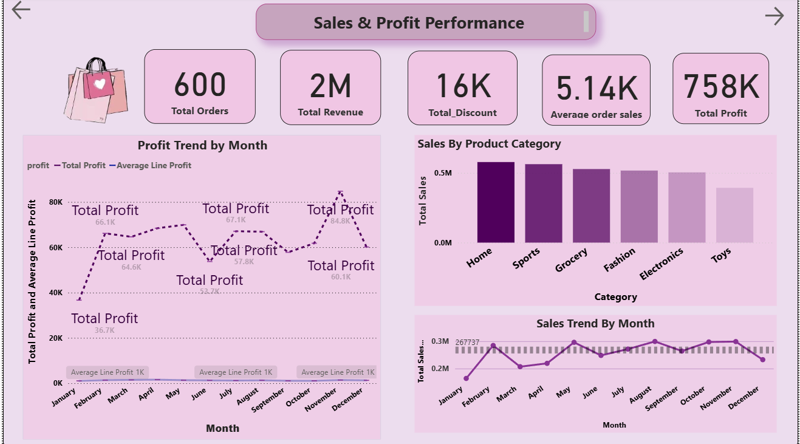

# power-Bi-project
This repository contains my power Bi project
# 🧾 Power BI Project - Shopping Trends Sales Analysis

This Power BI dashboard provides insights into customer shopping behavior, sales performance, and overall business trends. The goal of this project is to help stakeholders make data-driven decisions.

---

## 📊 Dashboard Overview
Key insights included in the report:

- 🛍️ Top-selling products and categories  
- 📅 Monthly sales trend analysis  
- 👩‍💼 Customer demographics and purchase behavior  
- 📈 Revenue analysis across different segments  

---

## 🛠 Tools Used

| Tool | Purpose |
|------|---------|
| Power BI | Dashboard & Visualization |
| Excel/CSV | Dataset |
| DAX | Calculated Columns & Measures |

---

## 📁 Dataset Information

The dataset contains the following attributes:

- Customer demographics (age group, gender)
- Product category and purchase quantity
- Order date and payment method
- Customer feedback & behavior patterns

---

## 📷 Screenshots

| Report View | Screenshot |
|------------|-----------|
| Dashboard Image |  |

---

## 📥 Download Project File

📁 Power BI File:  
`shopping_trends_sales_analysis_project.pbix`

---

## 🚀 Conclusion

This dashboard helps understand sales patterns and identify areas where business performance can be improved. It can be expanded for forecasting and further trend analysis using Machine Learning.

---

⭐ *Feel free to fork, explore and improve the project!*
---

---

## 📄 Resume

👉 [Click here to download my resume](Monika_M_Data_Analyst_Resume.pdf)

